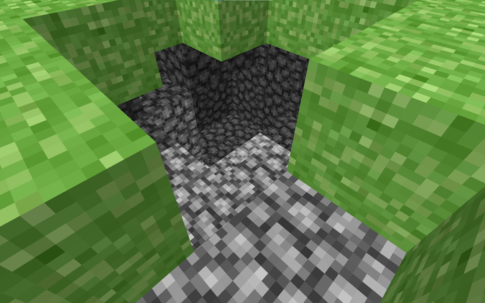
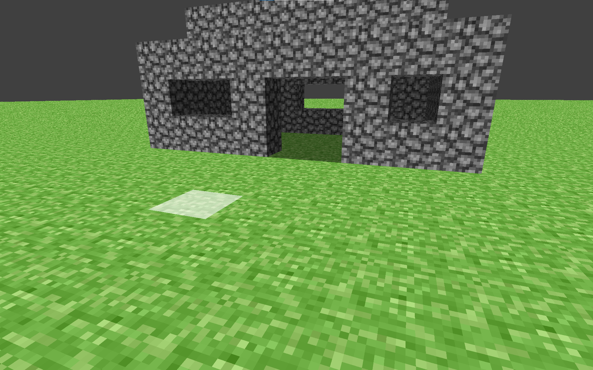

# ModernClassic - A Voxel Game Engine Project

<p align="center">
  
</p>

A creation game inspired by early versions of Minecraft, built from the ground up in Python using the **Ursina Engine**. This project showcases a custom-built rendering pipeline and a simple physics system.

---

## 📸 Screenshots

Here are a few moments from the world of ModernClassic.

| In-Game World :)                                  | Building Mechanics                              |
| -----------------------------------------------  | ----------------------------------------------- |
|  |  |

---

## ✨ Features

- **Custom Rendering Pipeline:** A from-scratch `Tessellator` class that builds chunk meshes, handling ambient occlusion and basic lighting.
- **Physics and Collisions:** A simple and effective physics implementation for player movement and interaction with the world.
- **Block Interaction:** Place and destroy blocks to shape the world around you.

---

## 🛠️ Built With

This project is built entirely in Python 3, leveraging these key libraries:
- [**Ursina Engine**](https://www.ursinaengine.org/) - For the core 3D rendering, windowing, and entity management.
- [**NumPy**](https://numpy.org/) - For high-performance numerical operations, especially in world generation and data management.
- [**Nuitka**](https://nuitka.net/) - For compiling the Python code into a high-performance, standalone executable.

---

## 🚀 Getting Started

To get a local copy up and running, follow these simple steps.

### Prerequisites

- Python 3.9+
- pip

### Installation

1.  Clone the repository:
    ```
    git clone https://github.com/arti-max/ModernClassic.git
    ```
2.  Navigate to the project directory:
    ```
    cd ModernClassic
    ```
3.  Install the required Python packages:
    ```
    pip install ursina
    pip install numpy
    ```

### Running the Game

To run the game from the source code, execute:
```

python main.py

```

---

## 🎮 Controls

- **WASD** - Move
- **Mouse** - Look around
- **Space** - Jump
- **Left Mouse Button** - Place a block
- **Right Mouse Button** - Destroy a block

---

## 🏗️ Building from Source ( Not Working)

This project uses **Nuitka** to compile into a standalone executable.

### Windows

```

python -m nuitka --standalone --onefile --windows-disable-console --include-data-dir=res=res --plugin-enable=ursina main.py

```

### Linux

```

python3 -m nuitka --standalone --include-data-dir=res=res --plugin-enable=ursina main.py

```

### macOS

```

python3 -m nuitka --standalone --macos-create-app-bundle --include-data-dir=res=res --plugin-enable=ursina main.py

```

---

## Roadmap

- [ ] Implement a basic liquid system
- [ ] Add more block types with unique properties.
- [ ] Improve world generation with biomes, trees, and structures.
- [ ] Introduce simple enemy mobs.
- [ ] Implement a day/night cycle.
- [ ] Add multiplayer
- [ ] Create UI for pause menu

---

## Acknowledgements

- Inspired by the original Minecraft by Mojang.
- Built with the incredible Ursina Engine.
- A big thank you to the open-source community.

